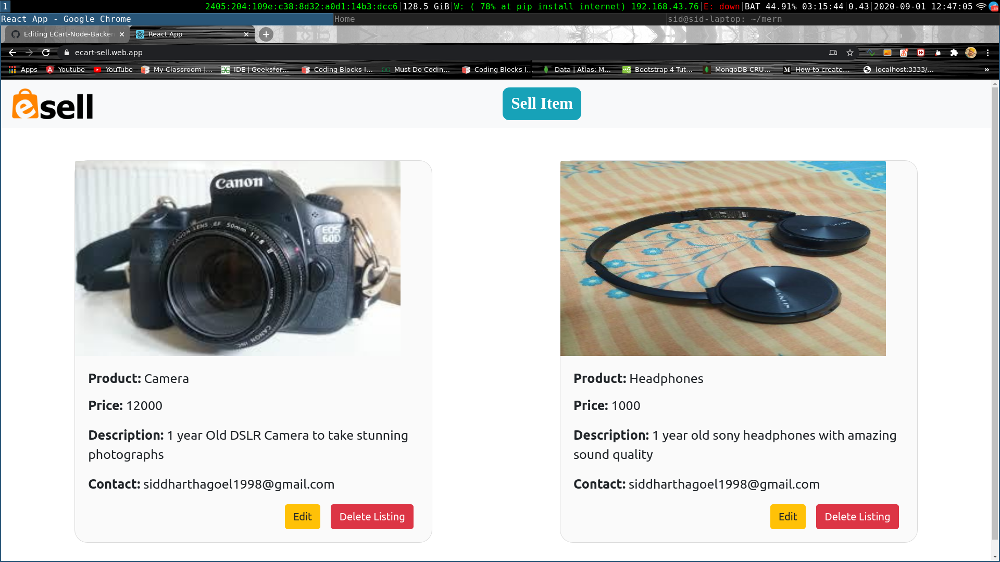
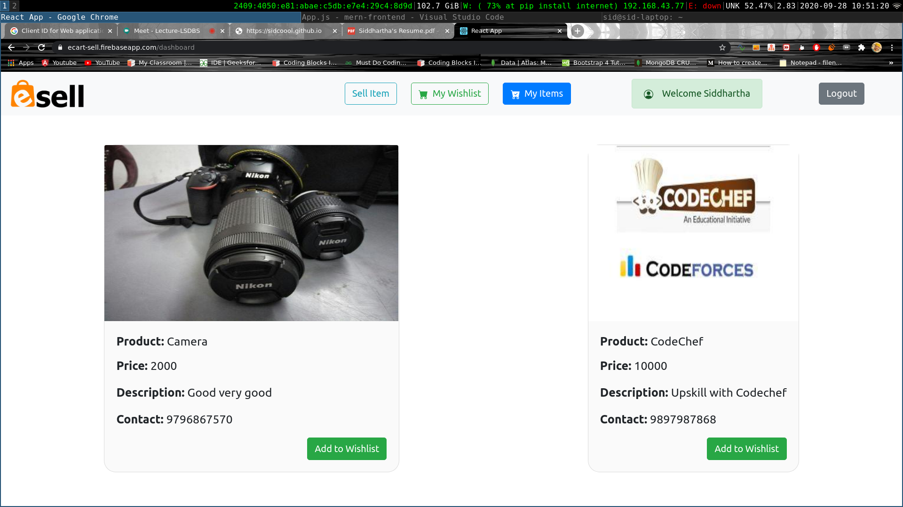
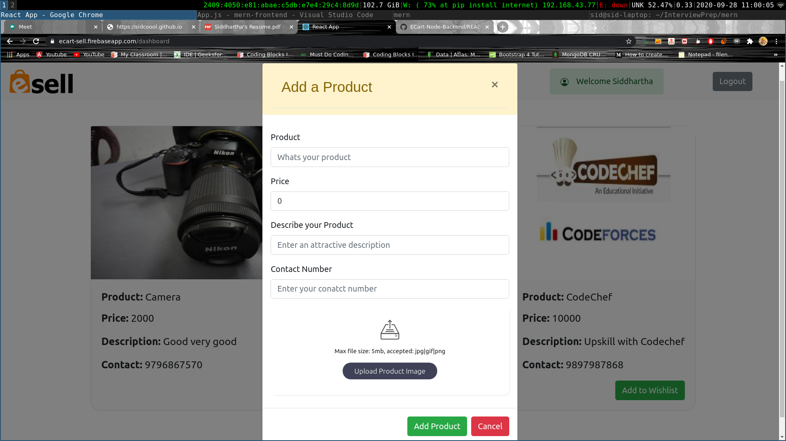

# Project Description
ECart React Frontend for adding, updating, retrieving, deleting services and goods such as electronics, fashion items, furniture, household goods, cars and bikes

## Backend Repository
[Go to Backend Repository](https://github.com/sidcoool/ECart-Node-Backend)

## Features
- Login/Signup using Google and Logout
- View Products.
- Add your own personal Items
- Add Products/Items in your Wishlist etc

## Built With
- React
- React Hooks
- Axios

## Folder Structure
```
├── firebase.json
├── package.json
├── package-lock.json
├── public
│   ├── favicon.ico
│   ├── index.html
│   ├── logo192.png
│   ├── logo512.png
│   ├── manifest.json
│   └── robots.txt
├── README.md
├── Screens
│   ├── s1.png
│   └── s2.png
├── src
│   ├── App.css
│   ├── App.js
│   ├── App.test.js
│   ├── Components
│   │   ├── AddProduct.js
│   │   ├── DeleteProduct.js
│   │   ├── EditProduct.js
│   │   ├── Login.js
│   │   ├── MyList.js
│   │   ├── Wishlist.js
│   │   ├── Products.js
│   │   └── TopBar.js
│   ├── Images
│   │   └── logo.png
│   ├── index.css
│   ├── Environments.js
│   ├── index.js
│   ├── logo.svg
│   ├── serviceWorker.js
│   └── setupTests.js
└── yarn.lock
```

## Sreenshots





## Contact

Siddhartha Goel - [Linkedin](https://linkedin.com/in/siddhartha-goel-b2098117a) – siddharthagoel1998@gmail.com
Distributed under the MIT license. See ``LICENSE`` for more information.

[![License][license-image]][license-url]

[license-image]:https://img.shields.io/badge/license-MIT-blue.svg

[license-url]:https://raw.githubusercontent.com/clamytoe/pyTrack/master/LICENSE
